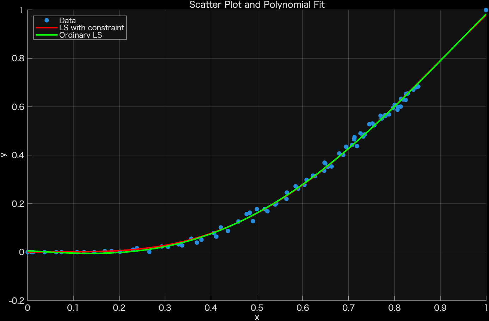
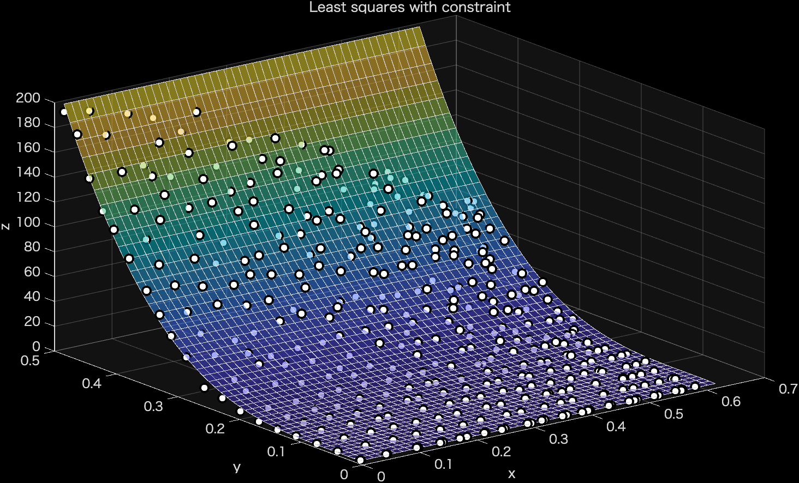
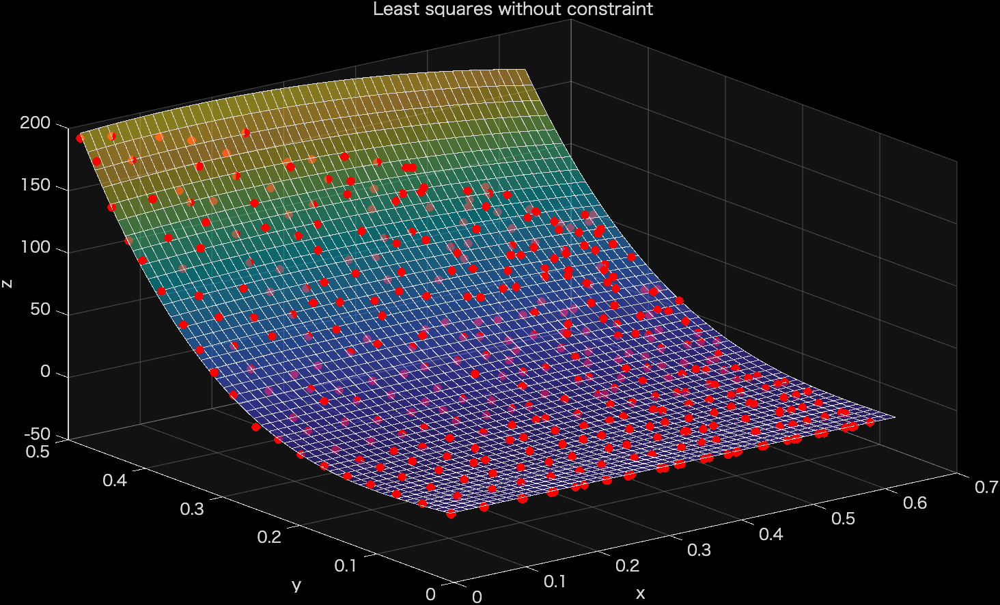

# Constrained-Least-Squares

MATLAB implementation of a **constrained least-squares polynomial fit** that enforces a
**monotonically increasing** and **non-negative** curve/surface. This produces smooth,
physically valid interpolation functions — useful, for example, as material interpolation
functions in topology optimization, where an unconstrained fit can otherwise produce
non-monotonic or negative values that have no physical meaning.

## Citation

If you use this code, **please cite** the following paper:

> N. Ishida, K. Furuta, M. Kishimoto, T. Sasaki, H. Iwai, K. Izui and S. Nishiwaki:
> "Data-driven topology optimization of all-solid-state batteries considering conductive
> additive material informed by microstructure analysis", *Structural and Multidisciplinary
> Optimization*, 68 (2025), 164.
> doi: [10.1007/s00158-025-04094-9](https://doi.org/10.1007/s00158-025-04094-9)


## Features

- Constrained least squares via `lsqlin`, enforcing:
  - monotonic increase (non-negative derivative)
  - non-negative values
- Works with both **1D** (`y = f(x)`) and **2D** (`z = f(x, y)`) input data
- Compares the constrained fit against an ordinary (unconstrained) least-squares fit,
  using the Akaike Information Criterion (AIC) to help choose the polynomial degree

## Repository structure

```
Least_square_1d/    1D template: Leastsq_with_constraint_1D.m
Least_square_2d/    2D template: Leastsq_with_constraint_2D.m
Output_ex/          Example output figures
```

Each template folder contains its own `function/` directory with the helper functions
it depends on (matrix construction, polynomial evaluation, etc.) and a sample `input.dat`.

## Usage

1. Prepare an `input.dat` file:
   - **1D**: two columns, `x y`
   - **2D**: three columns, `x y z`
2. Open the folder that matches your input's dimensionality and run the script:
   - 1D: `Least_square_1d/Leastsq_with_constraint_1D.m`
   - 2D: `Least_square_2d/Leastsq_with_constraint_2D.m`
3. Adjust the polynomial degree (`n`, and `m` for 2D) at the top of the script as needed.

Requires MATLAB's Optimization Toolbox (for `lsqlin`).

## Example output

| 1D | 2D (with constraint) | 2D (without constraint) |
|---|---|---|
|  |  |  |

## License

Distributed under the MIT License. See [LICENSE](LICENSE) for details.
